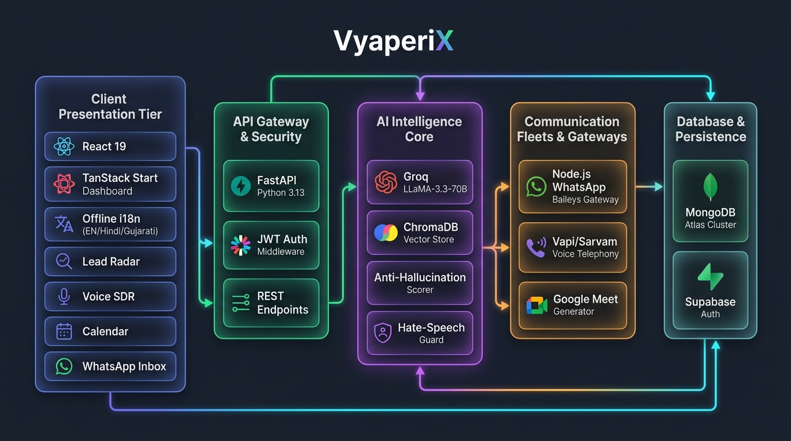
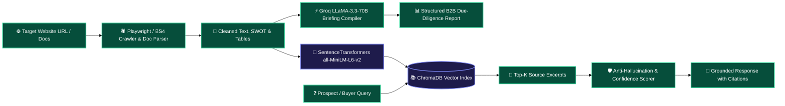
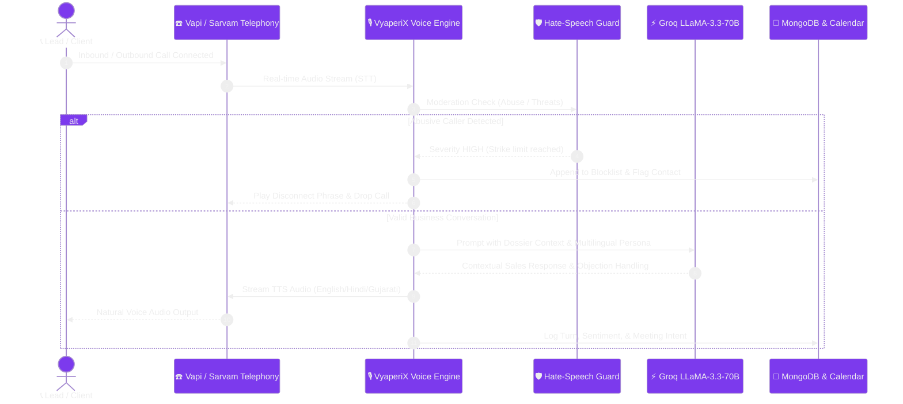
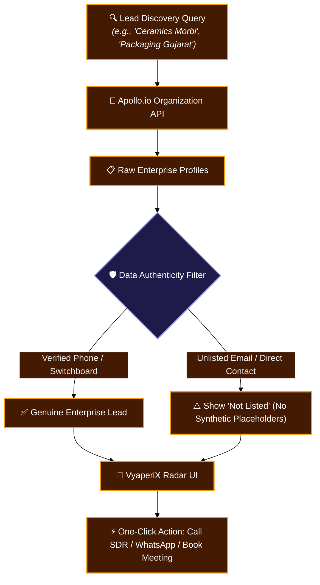
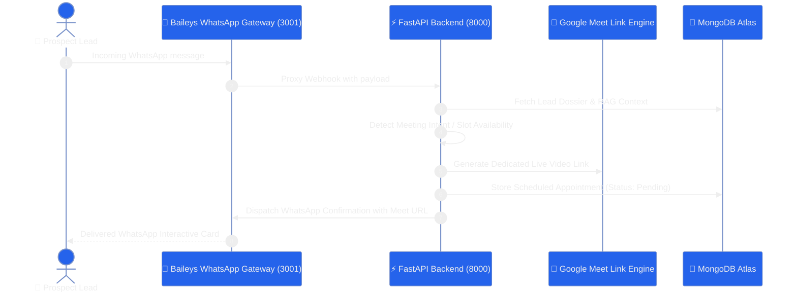

# 🏗️ VYAPERI X — System Architecture & Technical Blueprint

> **VyaperiX** is an enterprise-grade **Autonomous AI Sales, Commercial Due-Diligence, & Multilingual Fleet Platform** engineered for Indian and global B2B commerce. It integrates real-time web crawlers, multimodal document parsers, grounded RAG intelligence, autonomous voice SDRs, interactive video personas, and WhatsApp CRM dispatchers.

---

## 🌟 1. Complete End-to-End System Architecture

```mermaid
%%{init: {'theme': 'base', 'themeVariables': { 'primaryColor': '#4338ca', 'edgeLabelBackground':'#1e1b4b', 'tertiaryColor': '#0f172a', 'darkMode': true }}}%%
graph TB
    %% ================= CLIENT TIER =================
    subgraph CLIENT_TIER["🖥️ Client Tier — React 19 / TanStack Start / Tailwind CSS"]
        direction TB
        UI_LANDING["🌐 Public Landing Page<br/><code>/</code>"]
        UI_AUTH["🔐 Auth & Onboarding<br/><code>/login</code> & <code>/onboarding</code>"]
        
        subgraph DASHBOARD["📊 Central Executive Dashboard (/dashboard)"]
            MOD_OVERVIEW["📈 Overview & KPI Telemetry"]
            MOD_RADAR["🎯 Apollo Lead Radar"]
            MOD_SCRAPER["🔍 Scraper & Due-Diligence"]
            MOD_VOICE["🎙️ Voice SDR Call Logs"]
            MOD_VIDEO["🎥 Tavus Video Sales Agent"]
            MOD_WHATSAPP["💬 WhatsApp Live CRM Inbox"]
            MOD_CALENDAR["📅 Smart Calendar & Meets"]
            MOD_SETTINGS["⚙️ Fleet & Security Settings"]
        end

        I18N_ENGINE["🌍 100% Offline i18n Engine<br/><code>EN | हिन्दी | ગુજરાતી</code><br/><i>(0 API Calls, MutationObserver)</i>"]
        ZUSTAND_STORE["📦 Zustand Global State<br/><i>(Auth, Workspace, Telemetry)</i>"]
    end

    %% ================= API GATEWAY & CONTROLLERS =================
    subgraph API_TIER["⚡ API Gateway & Routers — FastAPI (Python 3.13) [Port: 8000]"]
        direction TB
        AUTH_MW["🛡️ JWT Auth & Security Middleware<br/><i>(Supabase Auth Token Validation)</i>"]
        
        R_PROFILE["👤 Profile & Workspace Router<br/><code>/api/profile</code>"]
        R_RADAR["🎯 Radar & Prospecting Router<br/><code>/api/prospecting</code>"]
        R_SCRAPER["🕷️ Scraper & Ingestion Router<br/><code>/api/data-engine</code>"]
        R_CHAT["🤖 Grounded RAG Chat Router<br/><code>/api/chat</code>"]
        R_VOICE["📞 Telephony & Call Router<br/><code>/api/voice</code>"]
        R_VIDEO["🎬 Video Agent Router<br/><code>/api/video</code>"]
        R_WHATSAPP["📱 WhatsApp Webhook Router<br/><code>/api/whatsapp</code>"]
        R_CALENDAR["📆 Calendar & Schedule Router<br/><code>/api/calendar</code>"]
    end

    %% ================= AI ENGINES & SERVICES =================
    subgraph AI_TIER["🧠 Intelligence Core & Agent Services"]
        direction TB
        GROQ_LLM["⚡ Groq LLaMA-3.3-70B<br/><i>Ultra-Fast Inference (~150ms)</i>"]
        CHROMA_RAG["📚 ChromaDB Vector Store<br/><i>SentenceTransformers all-MiniLM-L6-v2</i>"]
        CONF_SCORER["📐 Mathematical Confidence Scorer<br/><i>Vector Similarity + Lexical Precision</i>"]
        
        SARVAM_VOICE["🗣️ Sarvam AI / Deepgram<br/><i>Indic STT / TTS & Voice Synthesis</i>"]
        TAVUS_VIDEO["👤 Tavus Video Persona API<br/><i>WebRTC Real-time Interactive Video</i>"]
        APOLLO_API["🏢 Apollo.io Enterprise API<br/><i>Real-time B2B Discovery & Switchboards</i>"]
        SECURITY_GUARD["🛑 Hate-Speech & Moderation Guard<br/><i>Automated Call Drop & Blacklisting</i>"]
    end

    %% ================= GATEWAYS & EXTERNAL INTEGRATIONS =================
    subgraph EXT_TIER["🔌 External Gateways & Communication Fleets"]
        direction TB
        WA_GATEWAY["📲 Node.js Baileys Gateway<br/><code>[Port: 3001]</code><br/><i>Multi-Device QR & Live WebSockets</i>"]
        VAPI_TELEPHONY["☎️ Vapi / Twilio SIP Trunk<br/><i>PSTN Outbound/Inbound Calls</i>"]
        GOOGLE_MEET["🎥 Google Meet & Calendar API<br/><i>Automated Meeting Link Generation</i>"]
        SCRAPE_ENGINES["🕷️ Playwright & BeautifulSoup<br/><i>Deep Web Crawling & Asset Extraction</i>"]
    end

    %% ================= DATABASE & STORAGE LAYER =================
    subgraph DATA_TIER["💾 Persistence & State Tier"]
        direction TB
        MONGO_DB[("🍃 MongoDB Atlas<br/><i>Optimized SRV DNS Resolver</i><br/>• Profiles & Reports<br/>• Calendar Events<br/>• Call Transcripts<br/>• Blocklist Records")]
        SUPABASE_AUTH[("⚡ Supabase Auth<br/>• User Identities<br/>• Row-Level Security<br/>• JWT Session Tokens")]
    end

    %% ================= CONNECTIONS =================
    CLIENT_TIER -->|"HTTP / REST / JSON"| API_TIER
    API_TIER --> AUTH_MW
    AUTH_MW --> R_PROFILE & R_RADAR & R_SCRAPER & R_CHAT & R_VOICE & R_VIDEO & R_WHATSAPP & R_CALENDAR

    %% AI Pipeline Links
    R_CHAT --> GROQ_LLM & CHROMA_RAG & CONF_SCORER
    R_SCRAPER --> SCRAPE_ENGINES & GROQ_LLM
    R_RADAR --> APOLLO_API
    R_VOICE --> SARVAM_VOICE & VAPI_TELEPHONY & SECURITY_GUARD & GROQ_LLM
    R_VIDEO --> TAVUS_VIDEO
    R_WHATSAPP --> WA_GATEWAY & GROQ_LLM
    R_CALENDAR --> GOOGLE_MEET & WA_GATEWAY

    %% Persistence Links
    API_TIER -->|"Async Motor Client (~160ms)"| MONGO_DB
    AUTH_MW -->|"Verify JWT"| SUPABASE_AUTH

    %% Styling
    classDef clientStyle fill:#1e1b4b,stroke:#6366f1,stroke-width:2px,color:#ffffff;
    classDef apiStyle fill:#064e3b,stroke:#10b981,stroke-width:2px,color:#ffffff;
    classDef aiStyle fill:#311042,stroke:#c084fc,stroke-width:2px,color:#ffffff;
    classDef extStyle fill:#451a03,stroke:#f59e0b,stroke-width:2px,color:#ffffff;
    classDef dataStyle fill:#172554,stroke:#3b82f6,stroke-width:2px,color:#ffffff;

    class CLIENT_TIER,UI_LANDING,UI_AUTH,DASHBOARD,MOD_OVERVIEW,MOD_RADAR,MOD_SCRAPER,MOD_VOICE,MOD_VIDEO,MOD_WHATSAPP,MOD_CALENDAR,MOD_SETTINGS,I18N_ENGINE,ZUSTAND_STORE clientStyle;
    class API_TIER,AUTH_MW,R_PROFILE,R_RADAR,R_SCRAPER,R_CHAT,R_VOICE,R_VIDEO,R_WHATSAPP,R_CALENDAR apiStyle;
    class AI_TIER,GROQ_LLM,CHROMA_RAG,CONF_SCORER,SARVAM_VOICE,TAVUS_VIDEO,APOLLO_API,SECURITY_GUARD aiStyle;
    class EXT_TIER,WA_GATEWAY,VAPI_TELEPHONY,GOOGLE_MEET,SCRAPE_ENGINES extStyle;
    class DATA_TIER,MONGO_DB,SUPABASE_AUTH dataStyle;
```

---

## 🧩 2. Layer-by-Layer Architectural Breakdown

### 2.1 Frontend Presentation Tier (Client)
* **Framework**: React 19 with TanStack Start & Vite for high-speed client-side routing.
* **Styling**: Tailwind CSS with custom glassmorphic styling, dark mode tokens, and responsive mobile drawers.
* **Global State**: Zustand centralized store managing active workspaces, authenticated user metadata, lead queues, and live telemetry feeds.
* **Zero-API Offline Translation Engine**:
  * Seamlessly toggles English (`en`), Hindi (`हि`), and Gujarati (`ગુ`).
  * Uses a client-side `MutationObserver` paired with 800+ pre-bundled dictionary strings.
  * Dynamically strips emoji prefixes, bullets, and badge tags to match strings with 0 latency and **zero external API calls**.

---

### 2.2 Backend & Micro-Services Gateway (Python FastAPI)
* **High-Performance Async Engine**: Python 3.13 FastAPI with async I/O handlers.
* **Security & Auth**: Supabase JWT validation layer verifying user access tokens on all protected endpoints.
* **Fast Database Access**: Async MongoDB Motor client equipped with optimized system DNS resolvers for sub-200ms query latency.

---

### 2.3 Commercial Ingestion & Grounded RAG Pipeline

1. **Crawler & Document Parser**: Extracts raw DOM trees, PDF contracts, Excel catalogs, and image text.
2. **LLM Synthesis**: Groq LLaMA-3.3-70B synthesizes SWOT analyses, product pricing models, competitor matrices, and executive summaries.
3. **Grounded Vector Search**: ChromaDB retrieves exact source text chunks.
4. **Anti-Hallucination Guard**: Combines cosine similarity with lexical overlap; refuses to speculate if confidence is below threshold.

---

### 2.4 Autonomous Multilingual Voice SDR Pipeline

---

### 2.5 Apollo B2B Lead Radar & Prospecting Pipeline

---

### 2.6 WhatsApp Gateway & Smart Calendar Booking

---

## 🗄️ 3. Data Model & Database Schemas

### MongoDB Collections Schema (`VyaperiX Database`)

| Collection Name | Description | Key Fields |
| :--- | :--- | :--- |
| `user_profiles` | User accounts & workspace settings | `user_id`, `email`, `company_name`, `telephony_settings`, `api_keys` |
| `scraped_data` | Scraped site evidence & raw page text | `user_id`, `url`, `content`, `headings`, `created_at` |
| `business_briefings` | Compiled due-diligence dossiers | `user_id`, `company_overview`, `swot_analysis`, `pricing`, `competitors` |
| `prospect_leads` | Apollo & pipeline leads | `user_id`, `name`, `company`, `phone`, `email`, `lead_score`, `status` |
| `voice_calls` | Voice SDR call records & transcripts | `user_id`, `call_id`, `phone_number`, `transcript`, `sentiment`, `duration` |
| `calendar_events` | Scheduled appointments & video meetings | `user_id`, `title`, `date`, `time`, `contact_name`, `phone`, `meet_link`, `status` |
| `blocklist` | Abusive callers & blocked numbers | `user_id`, `phone_number`, `reason`, `severity`, `blocked_at` |

---

## 🌐 4. Network, Ports & Service Topology

| Service | Technology | Port | Public / Internal | Role |
| :--- | :--- | :--- | :--- | :--- |
| **Frontend Web App** | React 19 / TanStack Start / Vite | `8080` / `3000` | Public | Executive UI, Offline i18n, Interactive Dashboards |
| **Intelligence Backend** | Python FastAPI / Uvicorn | `8000` | Public/API | Core Intelligence, RAG, Lead Scraper, SDR API |
| **WhatsApp Gateway** | Node.js / Express / Baileys | `3001` | Internal | WhatsApp Multi-Device QR Socket & Webhook Dispatcher |
| **Vector Database** | ChromaDB (Embedded / Server) | In-Process | Internal | Vector Embeddings for Grounded RAG Chat |
| **Primary Database** | MongoDB Atlas Cluster | Cloud (TLS 27017) | External | CRM Pipeline, Profiles, Transcripts, Calendar |
| **Auth Provider** | Supabase Auth (PostgreSQL) | Cloud (HTTPS) | External | User Identity, JWT Generation & Security Tokens |
